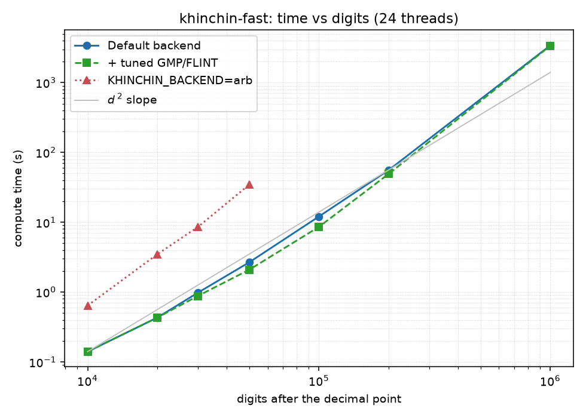

# khinchin-fast

Computes Khinchin's constant using a parallel Bailey-Borwein-Crandall
acceleration and an SCP-style reverse Bernoulli iterator implemented with
FLINT/Arb. FLINT uses GMP for large integer arithmetic and Arb tracks a rigorous
interval; the program writes a correctly rounded decimal expansion.

The `ports/` directory carries implementations of the same accelerated
series in seventeen more languages — FLINT-backed C++, Rust, Julia, and
Fortran, Python (30-37x faster than mpmath's built-in), PARI/GP, Maple,
Mathematica, Sage, and native-bignum ports for Go, Java, C#,
JavaScript, Ruby, Perl, Haskell, and OCaml — see the reference-ports
section below.

## Build

```sh
make
```

Fedora packages required: `gcc`, `flint-devel`, `mpfr-devel`, and `gmp-devel`.

## Use

The number is the requested count of digits after the decimal point:

```sh
./khinchin-fast 1000000 khinchin-1m.txt
```

Benchmark calculation without converting or writing the digits:

```sh
./khinchin-fast --benchmark 1000000
```

The reverse Bernoulli backend is the default. An independent Arb-based
backend is available for cross-checking:

```sh
KHINCHIN_BACKEND=arb ./khinchin-fast 10000 khinchin-arb-10k.txt
```

Timing statistics are printed to standard error. The result file contains only
the decimal value and a final newline. A conservative memory preflight rejects
jobs whose estimated peak exceeds 80% of physical RAM (see the memory section
below for the model and its calibration); `--force` overrides this check.

## Verifying

```sh
make check
```

verifies the C program against the 100-digit reference file
(`khinchin-100.txt`) and cross-checks its two independent backends, then
runs `check-ports.sh`, which builds and runs every port whose toolchain
is installed and requires its output files to be byte-identical to the
C program's at 100 and 1000 digits. `./bench.sh [d1 d2]` regenerates
the by-language speed table (full wall-clock, one run each — see its
header for how it differs from the curated table below).

Tuning and diagnostic environment variables for the default backend:
`KHINCHIN_N` overrides the power-table cut-off, `KHINCHIN_DIRECT` overrides
the split between the direct and Bernoulli regions, and `KHINCHIN_VERBOSE=1`
prints per-block ranges and timings.

## Benchmark on this machine

Intel Core Ultra 9 275HX, 24 threads, FLINT 3.4.0, August 25, 2026:

| Digits after decimal | Default backend | + tuned libraries | `KHINCHIN_BACKEND=arb` | Peak RAM |
|---:|---:|---:|---:|---:|
| 10,000 | 0.14 s | 0.14 s | 0.64 s | 37 MB |
| 20,000 | 0.43 s | 0.43 s | 3.47 s | 54 MB |
| 30,000 | 0.98 s | 0.88 s | 8.58 s | 77 MB |
| 50,000 | 2.67 s | 2.09 s | 34.61 s | 140 MB |
| 100,000 | 12.09 s | 8.58 s | not run | 342 MB |
| 200,000 | 55.75 s | 49.2 s | not run | 937 MB |
| 1,000,000 | 3413.29 s | 3371.28 s | not run | 16.1 GB |
| 2,000,000 | 31644.52 s | not run | not run | 55.8 GB |

The "+ tuned libraries" column is the same binary preloading the
CPU-tuned GMP/FLINT pair described in the tuned-libraries subsection
below (best of repeated same-day runs; same-day stock re-runs of
0.15/0.45/1.00/2.94/12.9 s confirm the gains are real and grow with
size rather than machine drift) — up to 100k digits. At one million
digits the tuned gain collapses to 1.2%: that regime is memory-bound
(see the memory section), and faster multiply kernels cannot speed up
waiting for DRAM.

The 2,000,000-digit row (August 27, 2026) is, as far as we can find,
the largest computation of Khinchin's constant on record — see
`MATHEMATICS.md`'s records section. It ran with `--force`, since the
deliberately conservative preflight refuses the job on this 64 GB
machine; measured peak was 55.8 GiB and the run fit in RAM (a standby
swapfile went unused). Its first 1,000,000 digits are byte-identical to
`khinchin-1m.txt`, and the full result is committed as
`khinchin-2m.txt`.



A log-log fit to the 10k-200k measurements is `time = O(digits^2.01)`, close
to the theoretical quadratic behaviour of the series. Beyond 200k the local
exponent steepens (about 2.5 between 200k and 1M, and 3.2 between 1M and 2M)
as the working set outgrows
the caches and the reverse Bernoulli iterators' quadratically growing state
starts to dominate: one million digits took 56.9 minutes, not the ~24 the
small-size fit projects, and two million took 8 h 47 m. For context, the
largest previously documented computation of
Khinchin's constant was 10^6 digits in about 12 days of single-core PARI
(University of Barcelona, 2016); this program reproduces it in under an hour
and doubles it overnight.
Extrapolating to one billion digits still gives centuries: the exponent, not
the constant factor, is the obstruction (see the next sections), and memory
(55.8 GiB peak at 2M, growing superlinearly) walls off the current in-memory
design well before time does — see the next section.

## Memory: the real limitation

Beyond roughly 200k digits, peak memory is dominated not by the shared power
tables (which grow about linearly with precision) but by the internal state of
FLINT's reverse Bernoulli iterators. An iterator started at `s = 2*n_direct`
stores about `2^(p/s)` scaled zeta powers whose per-entry precisions drop from
`p ~ s*(log2 s - 4.09)` bits — roughly quadratic growth in the digit count —
and about half the threads hold near-top iterators simultaneously, because the
heaviest blocks are scheduled first. Measured peak RSS (`/usr/bin/time -v`)
against the program's preflight estimate:

| Digits after decimal | Preflight estimate | Measured peak RSS |
|---:|---:|---:|
| 10,000 | 80 MiB | 37 MiB |
| 100,000 | 531 MiB | 337 MiB |
| 200,000 | 1,439 MiB | 947 MiB |
| 300,000 | 2,679 MiB | 1,957 MiB |
| 1,000,000 | 18.7 GiB | ~15.4 GiB |
| 2,000,000 | 61.7 GiB | 55.8 GiB |

The preflight models both allocations explicitly and is calibrated on the
measurements above to stay 1.1-1.6x over the actual peak — deliberately
conservative, since its job is to refuse jobs that would exhaust RAM.
On this 64 GB machine the preflight refuses
2 million digits (estimate above physical RAM), and the `--force` run in the
benchmark table confirms why the margin is thin: the job genuinely peaked at
55.8 GiB, within 6 GiB of the machine's total. Memory, not time, is the first
hard wall of the current all-in-memory design. Breaking past it would need out-of-core
Bernoulli generation or slice-wise recomputation of the zeta tails — both of
which give back part of the constant-factor speed this program exists to win.

## Comparison with PARI/GP

PARI/GP (2.18.1 development, multithreaded build, 24 threads) has no built-in
Khinchin constant, so the comparison uses a GP implementation of the same
accelerated series: a serial version with the incremental power table, and a
parallel version that splits the zeta range across threads with `parvector`.
The script lives at `ports/khinchin.gp` (current timings are also in
the by-language table below). Wall-clock times:

| Digits after decimal | GP serial | GP parallel (24 threads) | This program | Speedup vs GP parallel |
|---:|---:|---:|---:|---:|
| 10,000 | 4.62 s | 3.08 s | 0.14 s | 21x |
| 20,000 | not run | 16.72 s | 0.43 s | 39x |
| 50,000 | not run | 148.48 s | 2.67 s | 56x |

The GP results agree with this program's output digit for digit, which serves
as an additional independent cross-check (different zeta implementation,
different bignum stack above GMP).

## Reference ports in other languages

`ports/` holds implementations of the same accelerated series for other
systems. Every executable port takes `DIGITS [OUTPUT_FILE]` and, given a
file, writes the same decimal-plus-newline payload as the C program — all
seven produce byte-identical output files on this machine.

- `ports/khinchin.py` — fixed-point port on top of mpmath's internals.
  Measured 30x (1000 digits) to 37x (2000 digits) faster than mpmath's
  built-in `mp.khinchin` (the program on the OEIS entry), which uses the
  unaccelerated series. Deliberately serial: profiling shows 84% of the
  runtime inside mpmath's `mpf_bernoulli`, a strictly sequential cached
  recurrence, capping any multiprocess split at ~1.2x before IPC costs —
  and the GIL rules out threads. Installing gmpy2 switches mpmath's
  bignum backend to GMP automatically and is worth a further 3-7x (see
  the table below).
  The gmpy2 rows in the table below come from a local uv environment
  (gitignored), reproducible with:
  `uv venv --python 3.14t .venv-ft && uv pip install --python
  .venv-ft/bin/python mpmath gmpy2` — free-threaded CPython with
  mpmath's GMP backend; both Python ports run unchanged on it.
- `ports/khinchin_mt.py` — two-region variant of the Python port,
  mirroring the C program's split: the direct region (no Bernoulli
  numbers, pure-integer tail sums) fans out to threads while the main
  thread runs the shortened sequential Bernoulli region. 1.8x over the
  serial port at 10k digits (5.0 s on gmpy2, 39.9 s pure-Python) — but
  measurement attributes nearly all of it to the shorter recurrence, not
  the threads: one worker takes 4.85 s. Amdahl's law confirmed
  empirically.
- `ports/khinchin.gp` — the serial and parallel (`parvector`) PARI/GP
  scripts behind the comparison table above. Each parallel block seeds its
  alternating-harmonic weight `h(first)` by direct summation, which
  measured ~4x faster at 10k digits than seeding with `psi`.
- `ports/khinchin.jl` — Julia driving FLINT/Arb directly through plain
  `ccall` against the system libflint (no packages): `arb_zeta_ui` per
  term, blocked across Julia threads (`julia -t auto`). Only Arb's
  pointer-based API is used, so no C struct layouts are declared.
  0.72 s at 10k digits.
- `ports/khinchin.cpp` — C++17 mirroring the C program most closely of
  any port: FLINT's `bernoulli_rev` used natively (no FFI shim), the
  two-region split, and full dropping precision, over an RAII Arb
  wrapper with std::thread blocks. 0.26 s at 10k digits — the fastest
  port, within 1.8x of the C program.
- `ports/khinchin-rs/` — Rust with the C program's own two-region split:
  FLINT's reverse Bernoulli iterator (`bernoulli_rev`, reached through a
  30-line C shim built by `build.rs`, since its struct layout is not
  expressible in Rust FFI) streams exact `B_2n` per block below
  `n_direct`, and literal tail sums cover the region above it — no
  Bernoulli numbers there at all. rug arithmetic, rayon blocks, and the
  C program's dropping precision (a term of magnitude `N^(-2n)` only
  needs `wp - 2n log2 N` accurate bits, so table entries start at the
  precision of their final, most demanding use). 0.41 s at 10k digits.
- `ports/khinchin.f90` — Fortran binding FLINT/Arb through standard
  `ISO_C_BINDING` (pointer-based API only): `arb_zeta_ui` per term,
  OpenMP blocks, GNU MPFR for the final decimal formatting. 0.74 s at
  10k digits.
- `ports/khinchin.mpl` — Maple version of the same series, serial.
  Verified with Maple 2024.2: byte-identical output to the C program at
  1000 digits, digit-exact against the reference file at 10,000.
- `ports/khinchin.go`, `ports/Khinchin.java`, `ports/khinchin-cs/`,
  `ports/khinchin.mjs`, `ports/khinchin.rb`, `ports/khinchin.pl` — the
  "native bignum" family: fixed-point integers on each language's own
  arbitrary-precision type (math/big, Java BigInteger, .NET BigInteger,
  BigInt, Integer, Math::BigInt), sharing one
  design. None of these languages has bignum transcendentals, so each
  port carries a small fixed-point kit — pi by Machin's formula,
  logarithms via the atanh(1/q) series, exp by argument-halving plus
  Taylor — and takes zeta(2n) from the positive-term recurrence, but
  only below `n_direct`: the whole family carries the C program's
  two-region split, evaluating the large-n terms as literal tail sums
  with no zeta values at all, which shortens the O(M^2) recurrence to
  O(n_direct^2). Go fans the convolutions out
  over goroutines, Java over parallel streams, and C# over
  Parallel.For; Node, Ruby, and Perl are serial. All verified byte-identical to the C output at 1000
  digits. Perl doubles as a control experiment for the arithmetic
  layer: on the bundled FastCalc backend (schoolbook multiplication) it
  scales like d^3.6 — 31 s at 1000 digits and an extrapolated ~32
  hours at 10,000 — while installing Math::BigInt::GMP, which the port
  prefers automatically, drops that to 1.19 s and 78.7 s: a ~1,500x
  swing from the bignum library alone, with zero code changes. (Perl's port carries
  battle scars: Math::BigInt's bdiv returns (quotient, remainder) in
  list context, and a stray remainder in an argument list is silently
  taken as an accuracy parameter — two bugs of that family had to be
  found by bisection.)
- `ports/khinchin_sage.sage` — Sage on `RealBallField` (FLINT/Arb, the
  same strategy as the Julia/Fortran ports), serial. Verified with Sage
  10.9: byte-identical at 1000 digits — after first repairing the local
  Sage build, whose planarity module needed upstream's fix for the
  planarity 5.0 API break before anything could import.
- `ports/khinchin.hs` — Haskell on native `Integer` (GMP-backed via
  GHC). Verified with GHC 9.10.3: byte-identical at 1000 digits;
  fastest serial member of the native-bignum family at 10k.
- `ports/khinchin.ml` — OCaml on Zarith (GMP-backed). Verified with
  OCaml 5.2.1: byte-identical at 1000 digits, within 3% of Haskell.
- `ports/khinchin.wl` — Mathematica, serial. Implements the accelerated
  series directly (Mathematica evaluates `Zeta[2n]` symbolically through
  Bernoulli numbers), measured 12.7x faster than the built-in `Khinchin`
  constant at 1000 digits and 23x at 10,000 with Mathematica 14.2; the
  built-in — what the OEIS entry's program uses — is kept as
  `KhinchinBuiltin` for cross-checking. Byte-identical output to the C
  program at 1000 digits.

The table below makes one point measurable from three directions: the
ranking is set by the zeta strategy and the bignum library, not by the
host language. Ports that bind FLINT sit within a few multiples of the
C program regardless of language; ports on the self-contained
positive-term recurrence line up by the quality of their native bignum
arithmetic; and the same source file moves entire tiers when only its
arithmetic backend changes (see the Python and Perl rows).

### Measured speed by language

Same machine as the benchmarks above (24 threads), computing 1,000 and
10,000 digits after the decimal point; every port's output is
byte-identical — all eighteen implementations are now verified on this
machine. Rows are sorted by the 10,000-digit time:

| Implementation | Parallelism | 1,000 digits | 10,000 digits |
|---|---|---:|---:|
| C — `khinchin-fast` (this repo) | OpenMP | 0.007 s | 0.15 s |
| C++ + FLINT/Arb — `ports/khinchin.cpp` | std::thread | 0.025 s | 0.26 s |
| Rust + FLINT `bernoulli_rev` — `ports/khinchin-rs` | rayon | 0.033 s | 0.41 s |
| Julia + Arb — `ports/khinchin.jl` | threads | 0.005 s* | 0.72 s |
| Fortran + Arb — `ports/khinchin.f90` | OpenMP | 0.024 s | 0.74 s |
| PARI/GP — `ports/khinchin.gp` | parvector | 0.05 s | 2.8 s |
| Sage — `ports/khinchin_sage.sage`, RealBallField | serial | 0.03 s* | 4.2 s |
| Python + gmpy2, two-region — `ports/khinchin_mt.py` | threads | 0.03 s | 5.0 s |
| Python + gmpy2 — `ports/khinchin.py`, GMP backend | serial | 0.05 s | 9.0 s |
| Go — `ports/khinchin.go`, native math/big | goroutines | 0.08 s | 15.4 s |
| Mathematica — `ports/khinchin.wl` | serial | 0.12 s | 21.7 s |
| Java — `ports/Khinchin.java`, native BigInteger | parallel streams | 0.82 s | 30.8 s |
| C# — `ports/khinchin-cs`, native BigInteger | Parallel.For | 0.20 s | 36.5 s |
| Haskell — `ports/khinchin.hs`, native Integer | serial | 0.07 s | 54.0 s |
| OCaml — `ports/khinchin.ml`, Zarith | serial | 0.07 s | 55.7 s |
| Python — `ports/khinchin.py`, pure-Python backend | serial | 0.16 s | 64.5 s |
| Ruby — `ports/khinchin.rb`, native Integer | serial | 0.19 s | 71.2 s |
| Perl — `ports/khinchin.pl`, Math::BigInt + GMP backend | serial | 1.19 s | 78.7 s |
| Node.js — `ports/khinchin.mjs`, native BigInt | serial | 0.24 s | 127 s |
| Maple — `ports/khinchin.mpl` | serial | 8.5 s | 298 s |
| Mathematica built-in `Khinchin` | serial | 0.57 s | 508 s |
| mpmath built-in `mp.khinchin` | serial | 4.67 s | 11,634 s |

\* in-process, excluding interpreter startup (~0.2 s for Julia, ~3.5 s
for Sage); the others are full wall-clock. The mpmath built-in's
11,634 s (3 h 14 min, measured once on the pure-Python backend) is
78,000x the C program and 2,300x the accelerated Python port on the
same backend family — the whole reason `ports/khinchin.py` exists. Its
digit check flags only the final displayed digit, which it correctly
rounds up where the reference file truncates.

The ranking tracks the zeta strategy, not the language. The C program
still leads — dropping per-term precision and a rigorously certified
result on top of the same FLINT machinery — but the FLINT-bound
Rust/Julia/Fortran ports now sit within 4-5x of it and ahead of
everything else. PARI/GP rides PARI's Bernoulli machinery; the Python
ports ride mpmath's (pure-Python or GMP-backed); Mathematica's port
rides its symbolic `Zeta[2n]` and is 23x ahead of the built-in
`Khinchin`; Maple pays its software-float `evalf` layer serially.

## Why this is the fastest known approach

The claim has three layers — the formula, the zeta strategy inside it, and
the constant factors — and each was measured against its alternatives
rather than assumed.

**The formula.** Every known expression for `K0` was considered. The
defining product converges far too slowly for even tens of digits. The
dilogarithm and integral closed forms (`MATHEMATICS.md`,
section 4.5) converge only like `1/k^2` — verified numerically, and
useless for digit computation. The plain BBC zeta series needs `~P/2`
full-precision zeta terms; the accelerated form used here, with the small
`k` pulled out of every zeta tail, needs only `~P/(2 log2 N)`. That gap
alone is measurable: mpmath's built-in uses the plain series, and
`ports/khinchin.py`'s switch to the accelerated one — same language, same
bignum layer — is worth 30-37x. Gourdon/Sebah-style rearrangements are
the same family with different constants. The only thing that would beat
this family is a single series with rational terms amenable to binary
splitting — quasi-linear, like the formulas behind pi records — and no
such series for `K0` is known; finding one is an open problem (next
section). Within current mathematical knowledge, the accelerated zeta
series is the end of the line.

**The zeta values.** The accelerated series stands or falls on how fast
the `zeta(2n)` values arrive, and the ports in this repository ended up
being a controlled experiment across every practical strategy — same
machine, identical output digits:

| zeta(2n) strategy | Where | 10,000 digits |
|---|---|---:|
| Reverse Bernoulli iterator + direct low-precision tail region | C, this program | 0.15 s |
| `arb_zeta_ui` per term at full precision | `KHINCHIN_BACKEND=arb`, Julia/Fortran ports | 0.64-0.74 s, and scaling worse (34.6 s vs 2.67 s at 50k) |
| PARI's Bernoulli machinery | `ports/khinchin.gp` | 2.8 s |
| Reverse Bernoulli + direct tail + dropping precision | Rust port | 0.41 s |
| Positive-term recurrence, `O(M^2)` | native-bignum family (Go ... OCaml) | 15-127 s |
| Symbolic exact `Zeta[2n]` (Bernoulli rationals) | Mathematica port | 21.7 s |

**The constant factors.** On top of the winning strategy, this program
adds per-term dropping precision (a term of magnitude `N^(-2n)` only
needs about `P - 2n log2 N` accurate bits, so most arithmetic runs far
below full precision), the two-region split that eliminates Bernoulli
numbers entirely where the exact `B_2n` would carry more bits than the
working precision itself, and cost-model load balancing across threads.
That layer is why it runs 28x faster than FLINT's own
`arb_const_khinchin()` and reproduced the 2016 million-digit record
roughly 300x faster (under an hour against ~12 single-core days).

What remains is constant-factor tuning — and the ledger on it is now
complete. One factor was measured and banked (next subsection):
CPU-tuned builds of GMP and FLINT are worth 1.4-1.5x on this machine.
The other named candidate — batch multimodular Bernoulli generation —
was measured and closed: `bernoulli_fmpq_vec_no_cache` benchmarks
within 1-2% of the `bernoulli_rev` iterators at representative block
ranges (top-of-range and mid-range, narrow and wide), so FLINT's two
Bernoulli engines are interchangeable here and switching buys nothing.
The genuine walls are the quadratic exponent, which is a property of
the mathematics (next section) and cannot be engineered away, and the
memory growth documented above, which yields only to an out-of-core
redesign that would trade away part of the in-memory speed this
program exists for — a different program, not an optimization.

### CPU-tuned libraries: a measured 1.4-1.5x

Profiling shows ~75% of the C program's cycles inside GMP's mpn
assembly — and on this machine the hot symbols carry the `_x86_64`
suffix: Fedora's "fat" GMP selects CPU paths at runtime, but the Core
Ultra 9 (Arrow Lake) is newer than gmp 6.3.0's recognizer, so it falls
back to *generic* x86-64 code and never uses the mulx/adx assembly the
CPU supports. Forcing the tuning at build time fixes it:

```sh
# GMP with the skylake (mulx/adx) assembly paths; gnu17 works around
# GMP 6.3 configure vs GCC >= 15's C23 default:
./configure --build=skylake-pc-linux-gnu CFLAGS="-O2 -std=gnu17 -fomit-frame-pointer"
# FLINT with native codegen, linked against that GMP:
./configure CFLAGS="-O3 -march=native" --with-gmp-lib=... --with-gmp-include=...
```

Measured with both tuned libraries via `LD_PRELOAD` (digits verified
identical):

| Digits | System libraries | Tuned libraries | Gain |
|---:|---:|---:|---:|
| 50,000 | 3.19 s | 2.30 s | 1.38x |
| 100,000 | 12.96 s | 8.58 s | 1.51x |

The gain grows with operand size while the working set fits cache —
then collapses to 1.2% at one million digits (measured: 3371 vs 3413
s), where the run is memory-bound and arithmetic speed no longer
matters. The tuned pair lives in `~/opt/tuned-mathlibs/`; opt in with

```sh
LD_PRELOAD="$HOME/opt/tuned-mathlibs/libgmp.so.10 $HOME/opt/tuned-mathlibs/libflint.so.22" ./khinchin-fast ...
```

The tables elsewhere in this README keep the stock-Fedora numbers so
they stay reproducible on an unmodified system. But the finding applies
to every GMP/FLINT consumer on the machine, and a sweep of the ports
confirms it (10,000 digits, same-day stock -> tuned pairs, all outputs
digit-verified):

| Port | Stock | Tuned | Gain |
|---|---:|---:|---:|
| Rust | 0.40 s | 0.35 s | 1.14x |
| Julia | 0.67 s | 0.50 s | 1.33x |
| Fortran | 0.60 s | 0.46 s | 1.30x |
| PARI/GP | 2.66 s | 2.46 s | 1.08x |
| Sage | 4.17 s | 3.25 s | 1.28x |
| Python + gmpy2, two-region | 5.00 s | 4.18 s | 1.20x |
| Haskell | 50.96 s | 42.59 s | 1.20x |
| OCaml | 51.70 s | 43.09 s | 1.20x |
| Ruby | 69.33 s | 60.64 s | 1.14x |
| Perl + GMP backend | 75.84 s | 66.88 s | 1.13x |

Go, Java, Node.js, Mathematica, Maple, and pure-Python mpmath do not
link GMP and are unaffected. Two notes: gmpy2 bundles its own GMP
inside the wheel, but LD_PRELOAD symbol interposition overrides it —
the 1.20x is real; and Sage accepts the preload cleanly despite its
vendored library stack. (yafu and any other GMP-heavy tool on this
machine would see similar gains.)

## Known mathematical approaches (all ~quadratic)

Every published way to compute Khinchin's constant to high precision reduces
to summing many high-precision zeta-related terms:

1. **Bailey-Borwein-Crandall zeta acceleration (1997)** - what this program
   uses. Needs `M = P/(2 log2 N)` terms, each requiring the corresponding
   `zeta(2n)` to nearly full absolute precision. Cost about `d^2/polylog`.
2. **Gourdon/Sebah-style variants** - same family, different acceleration
   constants and series rearrangements. Same asymptotics, only constant-factor
   differences.
3. **Direct definition** - the product over continued-fraction densities,
   `prod (1 + 1/(k(k+2)))^(log2 k)` - converges far too slowly; the BBC series
   is the accelerated form of this.
4. **Bernoulli-number route** (the recmo/SCP trick this program runs) -
   replaces expensive independent zeta evaluations with a reverse Bernoulli
   recurrence. Big constant-factor win, same exponent.

The structural obstruction: for pi or log 2, the digits come from a single
hypergeometric series with rational terms, which binary splitting evaluates in
`O(M(d) log d)` - quasi-linear. Khinchin's constant is a sum of infinitely
many algebraically independent transcendentals (`zeta(2)`, `zeta(4)`, ...),
each needed to full precision. No one has found a single closed-form series
with rational terms for it. That is not a gap in engineering effort - it is an
open problem in mathematics. If you found such a series, that would be a
publishable result in its own right; it is the only thing that would make
10^9 digits feasible.

## Implementation notes

Term `n` of the accelerated sum has magnitude about `N^(-2n)`, so it only
needs about `P - 2n log2 N` accurate bits, and

```
zeta(2n) - 1 - sum_{2<=k<N} k^(-2n)  =  sum_{k>=N} k^(-2n).
```

The SCP backend splits the zeta range at `n_direct ~ P/(2(log2 N + 3))`:

- **Direct region** (`n >= n_direct`, about the top third of the range): the
  term is computed as the literal tail sum over `k` in `[N, K]` with
  `K ~ 2^(P/2n) <= 8N`, entirely at low precision - no Bernoulli numbers, no
  cancellation, no full-precision arithmetic. A rigorous integral bound covers
  the omitted `k > K`. Before this split, profiling showed the reverse
  Bernoulli iterator dominating exactly here, because the exact `B_2n` carry
  about `2n log2 n` bits - more than the working precision itself near the top
  of the range.
- **Bernoulli region** (`n < n_direct`): FLINT's reverse Bernoulli iterator
  reconstructs `zeta(2n)`, which is near 1 and genuinely needs full precision
  there. Power-table entries and the tail assembly still run at their own
  dropping precisions.

Work is divided into about four blocks per thread, sized by an analytic cost
model, sorted heaviest first, and scheduled dynamically. Four blocks per
thread is the measured optimum: two per thread performs the same within noise,
while eight per thread is ~20% slower because every extra Bernoulli block pays
its own iterator initialisation. Each worker traverses
its block with a shared power table whose entries start at the precision their
final, most demanding use requires. The final interval includes the proven
truncation bounds, and decimal rounding succeeds only when Arb proves the
scaled integer is unique.

The backend was adapted from the algorithmic approach in Remco Bloemen's MIT
licensed `recmo/khinchin` work and FLINT's reverse Bernoulli implementation. See
`NOTICE.md` for source links and licenses.
